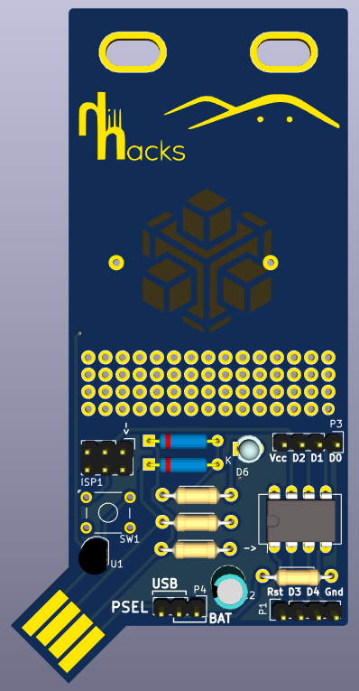

PCB badge for hillhacks.in
==========================

Designed in kicad 4.0.2

Based on Adafruit trinket and Digispark designs. Can use either Adafruit's trinket/gemma bootloader, or micronucleus(which digispark uses).
Reverse protection for USB and battery with schottky diodes(and supply selection also), no voltage regulator, Zener diodes are to clip D+/D- 
voltage level to within USB spec. 1.5k on D- is part of USB spec's Low speed USB detection.

Hillhacks logo is from header on site.

Design uses a footprint(pcb_USB-A) from Inversepath's Usbarmory kicad design https://github.com/inversepath/usbarmory/
